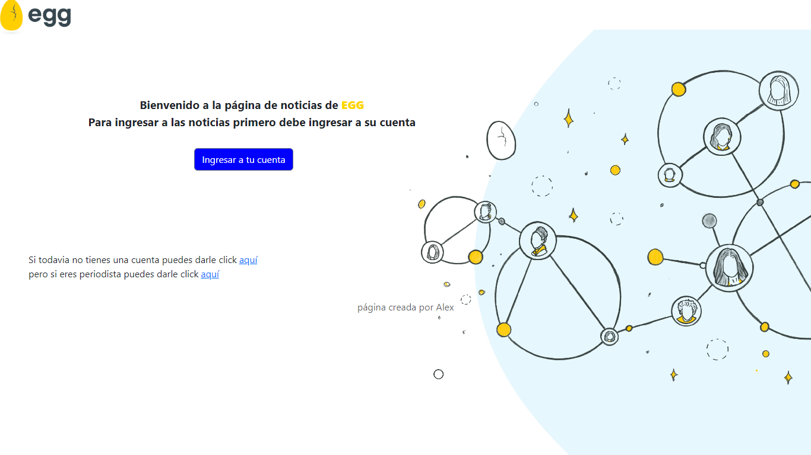
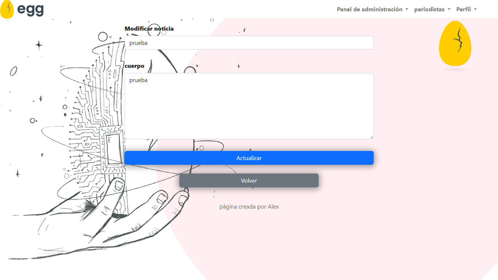
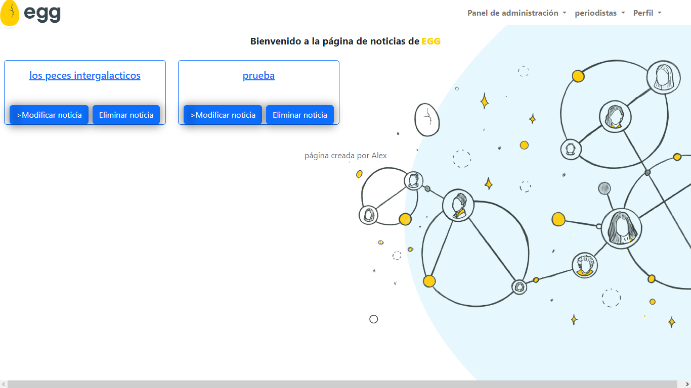
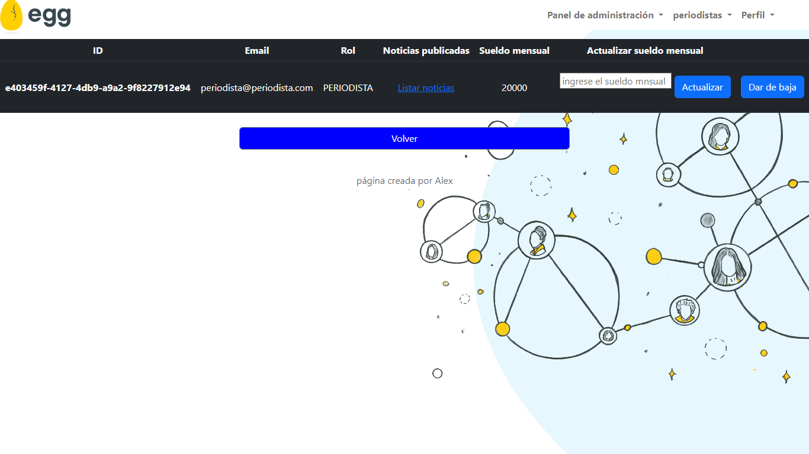
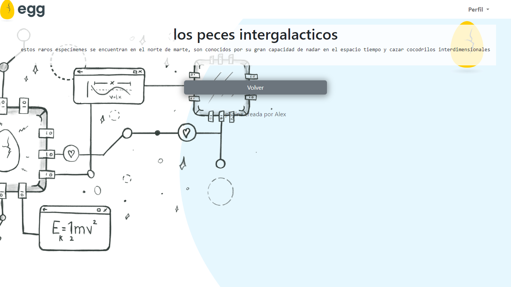
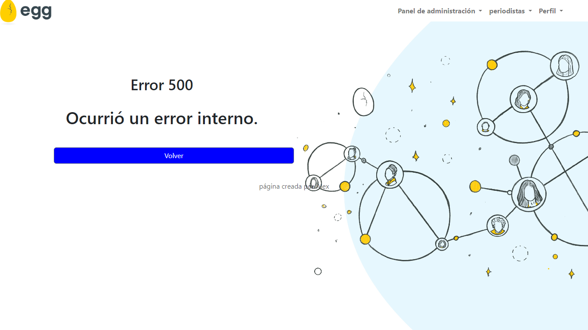

# Noticias Egg
Este proyecto es parte del curso Fullstack Web Developer de EGG Cooperation y tiene como objetivo desarrollar una plataforma de noticias para los usuarios de su plataforma,

Es el primer proyecto full stack y es parte de un ejercicio que teniamos que afrontar sin ayuda por lo que el proyecto es bastante básico y simple a comparación de los

siguientes proyectos.

La aplicación permitirá a los usuarios poder estar al tanto de las nuevas noticias que surjan y mantenerse al tanto de todo.

## Características

- Registro y Login: Los usuarios podrán registrarse e iniciar sesión en la aplicación para acceder a las funcionalidades.
- Gestión de Perfil: El administrador podrá editar los datos de los usuarios y periodistas.
- Selección de noticias: los usuarios podrán seleccionar la noticia que deseen ver y volver a la sección de noticias.
- Creación de noticias: los periodistas e inclusive el administrador, podrán crear noticias, modificarlas o eliminarlas.
- Cambio de Roles: La aplicación permitirá asignar diferentes roles a los usuarios, con distintos niveles de acceso y funcionalidades.

## Tecnologias

*Backend:* Java

*Frontend:* HTML5, CSS3

*Editor de código:* Visual Studio Code

*Frameworks:* Bootstrap, JPA, Thymeleaf

*Base de datos:* MySQL 

## Screenshots

|     |     |     |
| --- | --- | --- |
|  |  |  |
|  |  |  |
